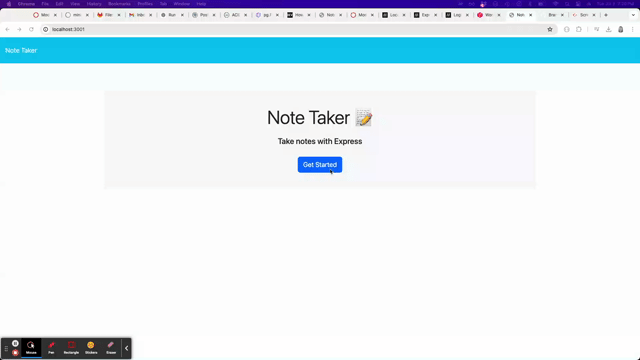

# Note Taker Starter Code

## Access Application
Project Link: [https://github.com/danielleboe/notesapp](https://github.com/danielleboe/notesapp)
 
App Link: https://note-app-ynb3.onrender.com/

## Description
An app that allows a user to create, save, view and delete notes.

User Story

- AS A small business owner
- I WANT to be able to write and save notes
- SO THAT I can organize my thoughts and keep track of tasks I need to complete

Acceptance Criteria

- GIVEN a note-taking application
- WHEN I open the Note Taker
- THEN I am presented with a landing page with a link to a notes page
- WHEN I click on the link to the notes page
- THEN I am presented with a page with existing notes listed in the left-hand column, plus empty fields to enter a new note title and the note’s text in the right-hand column
- WHEN I enter a new note title and the note’s text
- THEN a "Save Note" button and a "Clear Form" button appear in the navigation at the top of the page
- WHEN I click on the Save button
- THEN the new note I have entered is saved and appears in the left-hand column with the other existing notes and the buttons in the navigation disappear
- WHEN I click on an existing note in the list in the left-hand column
- THEN that note appears in the right-hand column and a "New Note" button appears in the navigation
- WHEN I click on the "New Note" button in the navigation at the top of the page
- THEN I am presented with empty fields to enter a new note title and the note’s text in the right-hand column and the button disappears

## Usage
### Run on local environment
1. Clone the Repo to a local environment.
2. Install Express npm install express
3. Run node server.js in directory
4. Navigate web browser to http://localhost:3001/

### View Live App
Link: https://note-app-ynb3.onrender.com/

## Demo Video

## Built With
Express
Node

<!-- LICENSE -->
## License

Distributed under the MIT License. See `LICENSE.txt` for more information.

<!-- CONTACT -->
## Contact
Danielle Boenisch danielleboenisch@gmail.com
Danielle Github Repo: https://github.com/danielleboe

Project Link: [https://github.com/danielleboe/notesapp](https://github.com/danielleboe/notesapp)

[license-url]: https://github.com/danielleboe/notesapp/blob/master/LICENSE.txt
